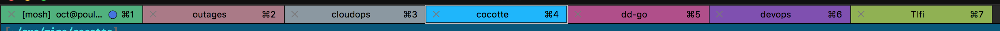

# Cocotte

Cocotte will colorize your iTerm tabs according to the parameter you pass. It is meant to work with your folder, giving a large hue range while being stable and more or less following the alphabetical order.



```shell
cocotte $(pwd)
# takes the path, do some computation and color your iterm tab according to this value.
```


# Building

```shell
cargo build --release
```

# Configuration

- create a `.cocotterc.toml` in your config home

Example:
```toml
blacklist = [
          "users",
          "pierrebaillet",
          ".",
          "Documents",
          "src",
          "datadog",
          "mine"
]
```

- if a parameter is only containing `blacklist` items, cocotte will return black as color:

```shell
cocotte -v -r /Users/pierrebaillet/src/github.com
Verbose enabled.
Reading configuration from: "/Users/pierrebaillet/.cocotterc.toml"
Black list is: ["users", "pierrebaillet", ".", "Documents", "src", "datadog", "mine", "github.com", "go"]
Using input string: /users/pierrebaillet/src/github.com
Path components after filtering: []
R:0 G:0 B:0
```

## Configuration keys

### blacklist

- String list of path segments that will be ignored by the coloring algorithm

# Running

```shell
cocotte --help
```

```
cocotte $(pwd)
```

# Troubleshooting

```shell
cocotte -v -f html /users/pierrebaillet/src/github.com/mysuperepo
```

```shell
Verbose enabled.
Reading configuration from: "/Users/pierrebaillet/.cocotterc.toml"
Black list is: ["users", "pierrebaillet", ".", "Documents", "src", "datadog", "mine", "github.com", "go"]
Using input string: /users/pierrebaillet/src/github.com/mysuperepo
Path components after filtering: ["mysuperepo"]
R:0 G:254 B:164
```

# Fish integration

## ssh tab color

```shell
function ssh
    cocotte $argv
    /usr/bin/ssh $argv
end
```

## cwd tab color

In your `fish_prompt` configuration file

```shell
function fish_prompt

# [....]

  if test (command --search cocotte)
    cocotte (pwd)
  end
end
```

# Bash integration

## cwd tab color

To dynamically update your tab based on your current directory you use `PROMPT_COMMAND`  

edit `~/.bash_profile` and add the lines below (if `cocotte` is not in your `$PATH` you need to replace it by the full path to `cocotte`)
```shell
cocotte_update ()
{
 cocotte $(pwd)
}
PROMPT_COMMAND="cocotte_update; $PROMPT_COMMAND"
```

# Contributors

Thanks for contributing!

- Clément Delafargue @divarvel


